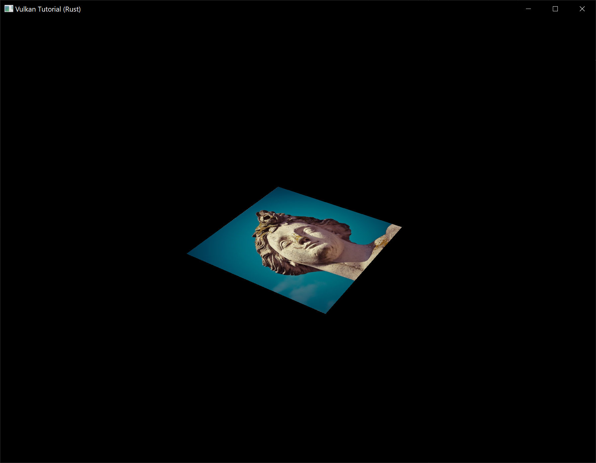
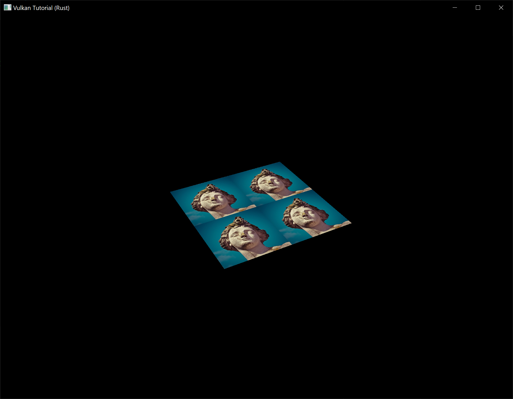
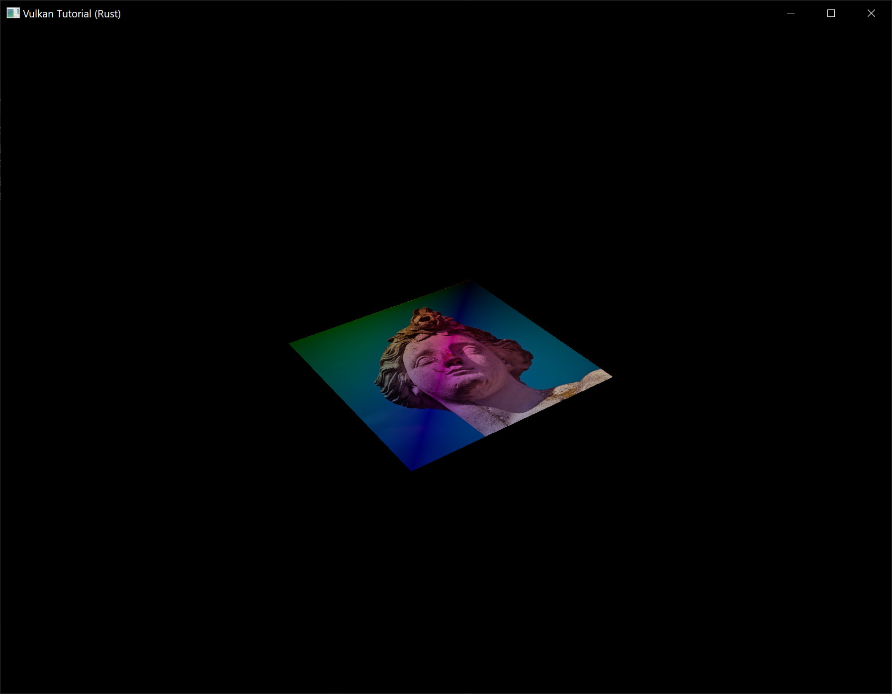

# Combined image sampler

**Code:** [main.rs](https://github.com/KyleMayes/vulkanalia/tree/master/tutorial/src/25_texture_mapping.rs) | [shader.vert](https://github.com/KyleMayes/vulkanalia/tree/master/tutorial/shaders/25/shader.vert) | [shader.frag](https://github.com/KyleMayes/vulkanalia/tree/master/tutorial/shaders/25/shader.frag)

We looked at descriptors for the first time in the uniform buffers part of the tutorial. In this chapter we will look at a new type of descriptor: *combined image sampler*. This descriptor makes it possible for shaders to access an image resource through a sampler object like the one we created in the previous chapter.

We'll start by modifying the descriptor layout, descriptor pool and descriptor set to include such a combined image sampler descriptor. After that, we're going to add texture coordinates to `Vertex` and modify the fragment shader to read colors from the texture instead of just interpolating the vertex colors.

## Updating the descriptors

Browse to the `^create_descriptor_set_layout` function and add a `vk::DescriptorSetLayoutBinding` for a combined image sampler descriptor. We'll simply put it in the binding after the uniform buffer:

```rust,noplaypen
let sampler_binding = vk::DescriptorSetLayoutBinding::builder()
    .binding(1)
    .descriptor_type(vk::DescriptorType::COMBINED_IMAGE_SAMPLER)
    .descriptor_count(1)
    .stage_flags(vk::ShaderStageFlags::FRAGMENT);

let bindings = &[ubo_binding, sampler_binding];
let info = vk::DescriptorSetLayoutCreateInfo::builder()
    .bindings(bindings);
```

Make sure to set the `stage_flags` to indicate that we intend to use the combined image sampler descriptor in the fragment shader. That's where the color of the fragment is going to be determined. It is possible to use texture sampling in the vertex shader, for example to dynamically deform a grid of vertices by a [heightmap](https://en.wikipedia.org/wiki/Heightmap).

We must also create a larger descriptor pool to make room for the allocation of the combined image sampler by adding another `vk::DescriptorPoolSize` of type `vk::DescriptorType::COMBINED_IMAGE_SAMPLER` to the `vk::DescriptorPoolCreateInfo`. Go to the `^create_descriptor_pool` function and modify it to include a `vk::DescriptorPoolSize` for this descriptor:

```rust,noplaypen
let sampler_size = vk::DescriptorPoolSize::builder()
    .type_(vk::DescriptorType::COMBINED_IMAGE_SAMPLER)
    .descriptor_count(data.swapchain_images.len() as u32);

let pool_sizes = &[ubo_size, sampler_size];
let info = vk::DescriptorPoolCreateInfo::builder()
    .pool_sizes(pool_sizes)
    .max_sets(data.swapchain_images.len() as u32);
```

Inadequate descriptor pools are a good example of a problem that the validation layers will not catch: As of Vulkan 1.1, `allocate_descriptor_sets` may fail with the error code `vk::ErrorCode::OUT_OF_POOL_MEMORY` if the pool is not sufficiently large, but the driver may also try to solve the problem internally. This means that sometimes (depending on hardware, pool size and allocation size) the driver will let us get away with an allocation that exceeds the limits of our descriptor pool. Other times, `allocate_descriptor_sets` will fail and return `vk::ErrorCode::OUT_OF_POOL_MEMORY`. This can be particularly frustrating if the allocation succeeds on some machines, but fails on others.

Since Vulkan shifts the responsiblity for the allocation to the driver, it is no longer a strict requirement to only allocate as many descriptors of a certain type (`vk::DescriptorType::COMBINED_IMAGE_SAMPLER`, etc.) as specified by the corresponding `descriptor_count` members for the creation of the descriptor pool. However, it remains best practise to do so, and in the future, `VK_LAYER_KHRONOS_validation` will warn about this type of problem if you enable [Best Practice Validation](https://vulkan.lunarg.com/doc/view/1.1.126.0/windows/best_practices.html).

The final step is to bind the actual image and sampler resources to the descriptors in the descriptor set. Go to the `create_descriptor_sets` function. The resources for a combined image sampler structure must be specified in a `vk::DescriptorImageInfo` struct, just like the buffer resource for a uniform buffer descriptor is specified in a `vk::DescriptorBufferInfo` struct. This is where the objects from the previous chapter come together.

```rust,noplaypen
let info = vk::DescriptorImageInfo::builder()
    .image_layout(vk::ImageLayout::SHADER_READ_ONLY_OPTIMAL)
    .image_view(data.texture_image_view)
    .sampler(data.texture_sampler);

let image_info = &[info];
let sampler_write = vk::WriteDescriptorSet::builder()
    .dst_set(data.descriptor_sets[i])
    .dst_binding(1)
    .dst_array_element(0)
    .descriptor_type(vk::DescriptorType::COMBINED_IMAGE_SAMPLER)
    .image_info(image_info);

device.update_descriptor_sets(
    &[ubo_write, sampler_write],
    &[] as &[vk::CopyDescriptorSet],
);
```

The descriptors must be updated with this image info, just like the buffer. This time we're using the `image_info` array instead of `buffer_info`. The descriptors are now ready to be used by the shaders!

## Texture coordinates

There is one important ingredient for texture mapping that is still missing, and that's the actual coordinates for each vertex. The coordinates determine how the image is actually mapped to the geometry.

```rust,noplaypen
struct Vertex {
    pos: glm::Vec2,
    color: glm::Vec3,
    tex_coord: glm::Vec2,
}

impl Vertex {
    fn new(pos: glm::Vec2, color: glm::Vec3, tex_coord: glm::Vec2) -> Self {
        Self { pos, color, tex_coord }
    }

    fn binding_description() -> vk::VertexInputBindingDescription {
        vk::VertexInputBindingDescription::builder()
            .binding(0)
            .stride(size_of::<Vertex>() as u32)
            .input_rate(vk::VertexInputRate::VERTEX)
            .build()
    }

    fn attribute_descriptions() -> [vk::VertexInputAttributeDescription; 3] {
        let pos = vk::VertexInputAttributeDescription::builder()
            .binding(0)
            .location(0)
            .format(vk::Format::R32G32_SFLOAT)
            .offset(0)
            .build();
        let color = vk::VertexInputAttributeDescription::builder()
            .binding(0)
            .location(1)
            .format(vk::Format::R32G32B32_SFLOAT)
            .offset(size_of::<glm::Vec2>() as u32)
            .build();
        let tex_coord = vk::VertexInputAttributeDescription::builder()
            .binding(0)
            .location(2)
            .format(vk::Format::R32G32_SFLOAT)
            .offset((size_of::<glm::Vec2>() + size_of::<glm::Vec3>()) as u32)
            .build();
        [pos, color, tex_coord]
    }
}
```

Modify the `Vertex` struct to include a `glm::Vec2` for texture coordinates. Make sure to also add a `vk::VertexInputAttributeDescription` so that we can use access texture coordinates as input in the vertex shader. That is necessary to be able to pass them to the fragment shader for interpolation across the surface of the square.

```rust,noplaypen
lazy_static! {
    static ref VERTICES: Vec<Vertex> = vec![
        Vertex::new(glm::vec2(-0.5, -0.5), glm::vec3(1.0, 0.0, 0.0), glm::vec2(1.0, 0.0)),
        Vertex::new(glm::vec2(0.5, -0.5), glm::vec3(0.0, 1.0, 0.0), glm::vec2(0.0, 0.0)),
        Vertex::new(glm::vec2(0.5, 0.5), glm::vec3(0.0, 0.0, 1.0), glm::vec2(0.0, 1.0)),
        Vertex::new(glm::vec2(-0.5, 0.5), glm::vec3(1.0, 1.0, 1.0), glm::vec2(1.0, 1.0)),
    ];
}
```

In this tutorial, I will simply fill the square with the texture by using coordinates from `0, 0` in the top-left corner to `1, 1` in the bottom-right corner. Feel free to experiment with different coordinates. Try using coordinates below `0` or above `1` to see the addressing modes in action!

## Shaders

The final step is modifying the shaders to sample colors from the texture. We first need to modify the vertex shader to pass through the texture coordinates to the fragment shader:

```glsl
layout(location = 0) in vec2 inPosition;
layout(location = 1) in vec3 inColor;
layout(location = 2) in vec2 inTexCoord;

layout(location = 0) out vec3 fragColor;
layout(location = 1) out vec2 fragTexCoord;

void main() {
    gl_Position = ubo.proj * ubo.view * ubo.model * vec4(inPosition, 0.0, 1.0);
    fragColor = inColor;
    fragTexCoord = inTexCoord;
}
```

Just like the per vertex colors, the `fragTexCoord` values will be smoothly interpolated across the area of the square by the rasterizer. We can visualize this by having the fragment shader output the texture coordinates as colors:

```glsl
#version 450

layout(location = 0) in vec3 fragColor;
layout(location = 1) in vec2 fragTexCoord;

layout(location = 0) out vec4 outColor;

void main() {
    outColor = vec4(fragTexCoord, 0.0, 1.0);
}
```

You should see something like the image below. Don't forget to recompile the shaders!


The green channel represents the horizontal coordinates and the red channel the vertical coordinates. The black and yellow corners confirm that the texture coordinates are correctly interpolated from `0, 0` to `1, 1` across the square. Visualizing data using colors is the shader programming equivalent of `printf` debugging, for lack of a better option!

A combined image sampler descriptor is represented in GLSL by a sampler uniform. Add a reference to it in the fragment shader:

```glsl
layout(binding = 1) uniform sampler2D texSampler;
```

There are equivalent `sampler1D` and `sampler3D` types for other types of images. Make sure to use the correct binding here.

```glsl
void main() {
    outColor = texture(texSampler, fragTexCoord);
}
```

Textures are sampled using the built-in `texture` function. It takes a `sampler` and coordinate as arguments. The sampler automatically takes care of the filtering and transformations in the background. You should now see the texture on the square when you run the application:



Try experimenting with the addressing modes by scaling the texture coordinates to values higher than `1`. For example, the following fragment shader produces the result in the image below when using `vk::SamplerAddressMode::REPEAT`:

```glsl
void main() {
    outColor = texture(texSampler, fragTexCoord * 2.0);
}
```



You can also manipulate the texture colors using the vertex colors:

```glsl
void main() {
    outColor = vec4(fragColor * texture(texSampler, fragTexCoord).rgb, 1.0);
}
```

I've separated the RGB and alpha channels here to not scale the alpha channel.



You now know how to access images in shaders! This is a very powerful technique when combined with images that are also written to in framebuffers. You can use these images as inputs to implement cool effects like post-processing and camera displays within the 3D world.
